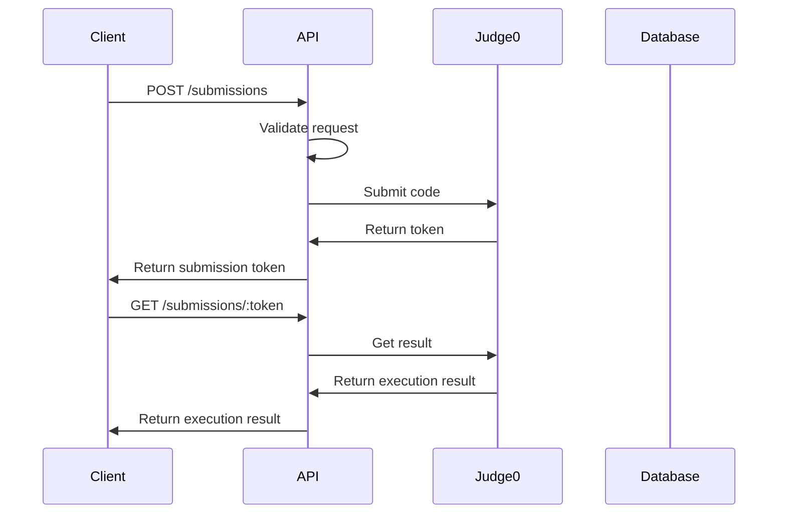
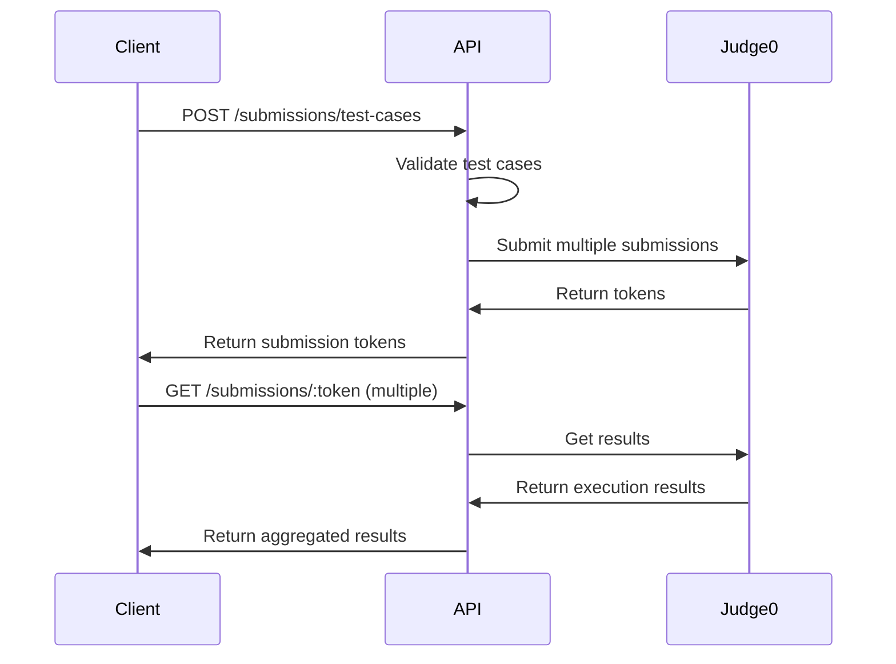

# LeetCode API

LeetCode API là một dịch vụ backend cung cấp khả năng thực thi code thông qua Judge0 API. API này cho phép người dùng gửi code để thực thi và nhận kết quả thực thi.

## Tính năng chính

- **Code Execution**: Thực thi code từ nhiều ngôn ngữ lập trình khác nhau
- **Test Cases**: Hỗ trợ chạy code với nhiều test cases
- **Real-time Results**: Nhận kết quả thực thi theo thời gian thực
- **Multiple Languages**: Hỗ trợ hơn 30 ngôn ngữ lập trình
- **Health Monitoring**: Kiểm tra trạng thái dịch vụ Judge0

## Cài đặt và chạy

### Yêu cầu hệ thống
- Node.js 16+ 
- npm hoặc yarn

### Cài đặt dependencies
```bash
cd leetcode-api
npm install
```

### Cấu hình môi trường
Tạo file `.env` với nội dung:
```env
# Server Configuration
PORT=5000

# Judge0 API Configuration
JUDGE0_API_URL=http://103.20.97.228:2358

# CORS Configuration
CORS_ORIGIN=http://localhost:3000

# Environment
NODE_ENV=development
```

### Chạy ứng dụng
```bash
# Development mode với auto-reload
npm run dev

# Production mode
npm start
```

## API Endpoints

### Base URL
```
http://localhost:5000/api
```

### 1. Submit Code (POST `/submissions`)

Gửi code để thực thi với input đơn giản.

**Request Body:**
```json
{
  "source_code": "print('Hello World')",
  "language_id": 71,
  "stdin": "optional input",
  "problemId": "optional-problem-id"
}
```

**Response:**
```json
{
  "success": true,
  "message": "Code submitted successfully",
  "data": {
    "token": "abc123",
    "status": "Submitted",
    "message": "Code submitted successfully",
    "language": "python3"
  }
}
```

### 2. Submit Code with Test Cases (POST `/submissions/test-cases`)

Gửi code để thực thi với nhiều test cases.

**Request Body:**
```json
{
  "source_code": "def add(a, b):\n    return a + b",
  "language_id": 71,
  "testCases": [
    {
      "input": "1 2",
      "output": "3"
    },
    {
      "input": "5 3",
      "output": "8"
    }
  ],
  "problemId": "add-two-numbers"
}
```

**Response:**
```json
{
  "success": true,
  "message": "Code submitted with test cases successfully",
  "data": {
    "tokens": ["abc123", "def456"],
    "status": "Submitted",
    "message": "Successfully submitted 2 test cases",
    "language": "python3"
  }
}
```

### 3. Get Submission Result (GET `/submissions/:token`)

Lấy kết quả thực thi của một submission.

**Response:**
```json
{
  "success": true,
  "message": "Submission result retrieved successfully",
  "data": {
    "status": "Accepted",
    "statusId": 3,
    "stdout": "Hello World\n",
    "stderr": "",
    "compile_output": "",
    "message": "",
    "time": 0.001,
    "memory": 1024,
    "passed": true,
    "language": "python3",
    "submitted_at": "2024-01-01T00:00:00.000Z",
    "statusDetails": {
      "id": 3,
      "description": "Accepted",
      "isAccepted": true,
      "isCompilationError": false,
      "isRuntimeError": false,
      "isTimeLimitExceeded": false,
      "isMemoryLimitExceeded": false,
      "isWrongAnswer": false
    }
  }
}
```

### 4. Get Supported Languages (GET `/submissions/languages`)

Lấy danh sách các ngôn ngữ lập trình được hỗ trợ.

**Response:**
```json
{
  "success": true,
  "message": "Supported languages retrieved successfully",
  "data": {
    "count": 32,
    "languages": {
      "54": "cpp17",
      "50": "c",
      "62": "java",
      "71": "python3",
      "63": "javascript",
      "74": "typescript"
    }
  }
}
```

### 5. Health Check (GET `/submissions/health/judge0`)

Kiểm tra trạng thái dịch vụ Judge0.

**Response:**
```json
{
  "success": true,
  "message": "Judge0 service is healthy",
  "data": {
    "status": "healthy",
    "message": "Judge0 service is available",
    "response": {
      "status": "ok"
    }
  }
}
```

## Ngôn ngữ lập trình được hỗ trợ

| ID | Ngôn ngữ | Mô tả |
|----|----------|-------|
| 54 | cpp17 | C++17 |
| 50 | c | C |
| 62 | java | Java |
| 71 | python3 | Python 3 |
| 63 | javascript | JavaScript |
| 74 | typescript | TypeScript |
| 51 | csharp | C# |
| 73 | rust | Rust |
| 75 | go | Go |
| 76 | kotlin | Kotlin |
| 77 | swift | Swift |
| 78 | php | PHP |
| 79 | ruby | Ruby |
| 80 | scala | Scala |
| 81 | dart | Dart |
| 82 | elixir | Elixir |
| 83 | erlang | Erlang |
| 84 | haskell | Haskell |
| 85 | clojure | Clojure |
| 86 | lua | Lua |
| 87 | perl | Perl |
| 88 | r | R |
| 89 | sql | SQL |
| 90 | bash | Bash |
| 91 | powershell | PowerShell |
| 92 | cobol | COBOL |
| 93 | fortran | Fortran |
| 94 | pascal | Pascal |
| 95 | prolog | Prolog |
| 96 | scheme | Scheme |
| 97 | smalltalk | Smalltalk |
| 98 | tcl | Tcl |
| 99 | whitespace | Whitespace |
| 100 | brainfuck | Brainfuck |

## Flow hoạt động

### 1. Code Submission Flow



### 2. Test Cases Flow



## Error Handling

### HTTP Status Codes

- `200 OK`: Request thành công
- `201 Created`: Tạo mới thành công
- `400 Bad Request`: Dữ liệu đầu vào không hợp lệ
- `404 Not Found`: Không tìm thấy submission
- `500 Internal Server Error`: Lỗi server
- `503 Service Unavailable`: Dịch vụ Judge0 không khả dụng

### Error Response Format

```json
{
  "success": false,
  "error": "Error message",
  "message": "Detailed error description",
  "details": []
}
```

## Rate Limiting

- **Code Submission**: 10 requests/minute
- **Result Fetching**: 60 requests/minute
- **Health Check**: 30 requests/minute

## Security

- CORS được cấu hình để chỉ cho phép các domain được tin cậy
- Input validation nghiêm ngặt để tránh injection attacks
- Timeout cho tất cả các request để tránh DoS attacks

## Monitoring và Logging

- Tất cả các request được log với timestamp
- Error logging chi tiết với stack trace
- Performance metrics cho mỗi submission
- Health check tự động cho Judge0 service

## Troubleshooting

### Common Issues

1. **Judge0 Service Unavailable**
   - Kiểm tra kết nối mạng
   - Verify JUDGE0_API_URL trong .env
   - Sử dụng endpoint `/submissions/health/judge0`

2. **Code Execution Timeout**
   - Kiểm tra code có vòng lặp vô hạn
   - Verify language_id được hỗ trợ
   - Kiểm tra input size

3. **Compilation Errors**
   - Verify syntax của code
   - Kiểm tra ngôn ngữ lập trình được chọn
   - Xem compile_output trong response

### Debug Mode

Để bật debug mode, set `NODE_ENV=development` trong file .env.

## Contributing

1. Fork repository
2. Tạo feature branch
3. Commit changes
4. Push to branch
5. Tạo Pull Request

## License

MIT License - xem file LICENSE để biết thêm chi tiết.
